# Maps, GPX and offline regions

GPX route geometry, waypoints, current position, hazards, and riders are stored
and rendered locally. The production map path uses the open-source MapLibre
Native SDK on both iOS and Android. It does not depend on Apple Maps and it does
not bulk-download from the public OpenStreetMap tile servers.

The daytime map has two saved settings: **Restrained** applies Tail End
Charlie's quieter road-first repaint to OpenFreeMap Liberty, while **Original**
keeps the provider's daytime colours and labels. They use the same vector tile
source and offline tile cache; only their small style-document caches are kept
separate so switching cannot serve the wrong palette.

## GPX behaviour

- Imports GPX 1.1 tracks, routes, and waypoints through the system picker.
- Preserves disconnected segments, elevation, timestamps, and waypoint detail.
- Stores a versioned parsed route in application support storage.
- Accepts UTF-8 files up to 10 MB and 200,000 points.
- Rejects invalid coordinates, document type declarations, and empty geometry.
- Treats recorded `<trk>` geometry as authoritative and never silently
  reroutes it.
- Recognises web-planner tracks carrying the Tail End Charlie
  `<tec:road-route>` extension as calculated road routes. During review the app
  can refresh those through the road router to recover manoeuvre instructions;
  an ordinary recorded track remains untouched.
- Offers an imported track with no manoeuvres as either **Follow original
  line** (fully offline) or **Generate navigable route** (online). The latter
  sends at most 90 bounded samples per continuous segment to OSRM's Match
  service, keeps the original in Saved routes, and creates a separately
  identified candidate with the returned road geometry and manoeuvres.
- Rejects a road-matched candidate before route review if the provider splits
  it into separate matches, reports under 70% confidence, matches under 90% of
  sampled points, moves the samples by more than 35 m on average, or moves any
  sample by more than 150 m. A successful review shows the original as a grey
  dashed line underneath the blue navigable candidate and states the measured
  confidence, coverage and deviation. Only **Confirm** makes the candidate the
  active route; cancellation and every failure leave the active route alone.
- Attempts to match sparse `<rte>` geometry, or waypoint-only GPX files, to the
  road network after an explicit import. If routing is unavailable, the original
  GPX remains usable and is stored unchanged.
- Includes a valid 17.5 km, 484-point GPX track following roads from the King's
  Oak Academy car park to the Cross Hands Hotel car park.

## Motorcycle discovery layers

Twisty highlights, mountain passes and good biking roads are independent and
off by default. The initial bundled Wales catalogue is a bounded,
manually-reviewed proof of concept derived from OpenStreetMap under ODbL. The
planned route remains visually dominant; tapping a highlight shows its source,
confidence, last-verified date and safety warning, and can append a routed leg
without discarding existing geometry or waypoints.

Suggestions are first saved as private offline drafts. A build only exposes the
explicit send action when `RIDE_RELAY_DISCOVERY_API_URL` is configured, and the
rider must confirm that action after connectivity returns. Public map data can
only come from the server's separately authenticated moderation pipeline.

```text
--dart-define=RIDE_RELAY_DISCOVERY_API_URL=https://api.tailendcharlie.app
```

Highlights are descriptive planning aids, not safety endorsements. Riders must
check signs, closures, restrictions, weather, surface and current conditions.

## Riding display

### Navigation surfaces

The app has two primary contexts, split by when the rider uses them:

- **Kerbside:** the labelled `Map`, `Details` and `Safety` navigation bar (or
  rail in landscape). Setup, roster, settings, history and sharing use words,
  and nothing in this context is reachable only through an unexplained icon.
- **Riding:** the map and its glanceable controls. Icon-only controls are
  allowed here because they must remain large enough for a gloved hand and the
  labelled navigation chrome is hidden while moving.

**Ride actions** is the one secondary surface shared by both contexts. The
labelled button on Details and the map's riding-time menu icon open the same
sheet. It contains settings, route setup, roster and sharing actions; it does
not duplicate Map/Details/Safety navigation. Leaving and ending a ride use one
combined **Leave or end ride** decision, so leaders see the option to end for
everyone without hunting for a separate End action.

While an active-ride screen is foregrounded, the app requests the platform
screen wake lock for the whole ride surface, not only while GPS says the bike
is moving or while the Map tab is selected. It reasserts that request when the
app resumes and every 15 seconds because iOS or Android may release a one-shot
request after window or lifecycle changes. The request is removed when the
ride surface is exited. This prevents automatic display sleep only; it does
not override a rider manually locking the phone, keep the app running after a
force-quit, or grant background CPU execution.

The map uses foreground GPS speed, heading, and remaining route geometry to
enter a heading-up follow view while moving. Landscape uses a wider zoom.
Manual pan or zoom suspends camera following and shows a **Re-centre** action
instead of snapping back on the next GPS update.

### Forward-looking framing

`NavigationCameraPlanner` drives zoom, tilt and forward bias from one
smoothstep curve on smoothed road speed, so the value and the gradient are
continuous and nothing snaps as the rider crosses a speed. The curve saturates
at 30 m/s.

- **Tilt** runs 51° to 58° in portrait and 53° to 58° in landscape. MapLibre
  Native clamps pitch at 60° on both Android and iOS, so 58° is the working
  ceiling with margin; a plan the platform silently clamps would end a
  transition somewhere other than where it was aimed.
- **Forward bias** puts the rider low in the frame rather than at its centre:
  0.56 to 0.70 of the viewport height in portrait, 0.58 to 0.72 in landscape,
  measured from the top edge. `maplibre_gl` exposes no camera padding, so the
  bias is applied by aiming the camera at a ground point ahead of the rider,
  computed from the tilt, zoom and measured viewport height, which lands the
  rider on the planned fraction rather than guessing a look-ahead distance. On
  the `flutter_map` fallback the same bias is a screen-space anchor offset.
- Portrait chrome sits in a band directly under the rider, so the bias is
  pulled back to keep the marker clear of the measured band height. With every
  overlay live at once the framing degrades towards a centred follow camera and,
  in the extreme, above centre: keeping the rider's own marker visible always
  beats keeping the bias. Landscape chrome is confined to side rails, so
  landscape keeps its full bias.

### Rotation

`NavigationHeadingSmoother` drives the map bearing. GPS course over ground is
the only authoritative source, and only at or above 1.5 m/s; below that the last
stable bearing is held, because a stationary GPS course is noise. The device
compass is deliberately never blended in — a phone mounted on a steel
motorcycle sits inside the bike's own magnetic field — and the only bearing
taken at rest is the first of a ride, in place of an arbitrary north-up map.
A course change is low-passed with a 0.9 s time constant, held entirely inside a
9° deadband so ordinary road curvature produces no rotation, tightened to 3°
when a manoeuvre is within 150 m, and rate limited to 45°/s so a 90° junction
settles in about two seconds without overshoot. Changes beyond 95° are rejected
until a following fix corroborates them, so GPS noise and tunnel re-acquisition
cost one update of latency instead of spinning the map. All comparisons take the
shortest angular path, so crossing north rotates the short way.

### Overlay placement

No persistent *status* surface is anchored to the top of the map: the upper band
is where a rider on a mounted phone reads the road ahead. The old ride-actions
hamburger has also been removed; setup actions now live on the labelled Ride
destination. Only **two small glances live in the map corners**:

| corner | portrait | landscape |
| --- | --- | --- |
| top leading | — | — |
| top trailing | group overview | speed sign |
| bottom trailing | — | group overview |

Each is hard against a screen edge, neither is wider than 45% or taller than 40%
of the viewport, and the centre and upper-middle stay empty. They are *glances*,
never targets, which is why the corner furthest from the road ahead is the
cheapest place on the screen for them. Moving the group overview out of the
bottom band also stops the camera's forward bias paying for a surface nobody
acts on.

Everything else is bottom-anchored. Portrait is one band: urgent alerts, the TEC
gap, then the turn banner, then the targets. Landscape splits into a left rail
(urgent alerts, TEC gap, turn banner, actions) and a right rail (recovery,
junction marker card, group overview), leaving the centre column clear. Each rail
is a single column, so placement stays deterministic and no surface can cover
another at any simultaneous overlay count. Urgent alerts still interrupt, but
they grow the band upwards rather than claiming the top band. Safe-area insets
are respected in both orientations, with or without the app bar.

**The turn banner is the last surface above the targets.** The TEC gap used to
sit between them; now everything above the banner is map, so a rider's eye leaves
the road for the banner and comes straight back. The test asserts that nothing
else occupies the space between the banner and the first target.

**The arrival question is offered in the band, never over the map.** It used to
arrive as a `showDialog` on reaching the destination — a barrier across the whole
surface at the one moment a rider still needed the navigation, which a tester
reported as a fault (#380). It is now a compact, dismissible control in the band
alongside the other surfaces.

Two things make that affordable. It cannot share the band with the paused banner
or the junction marker card: `_maybeAutomaticallyEndRide` returns early on a
paused ride and on an active marker, and the map repeats the paused guard because
that is the layer whose height is measured. And it is dense by design, because the
band is already close to its cap. Measured, not assumed: the worst band the
suggestion can appear in is **0.438** of the viewport against the 0.60 cap, where
the modal it replaces covered all of it.

Ending the ride for everyone still goes through the confirmation carrying
`endRideConsequence`. #380 was about the suggestion not blocking, not about
removing an irreversible action's consequence.

**SOS sits above LEAVE, with REPORT alongside the pair and the speed sign
opposite.** Stacking them costs no height — the two-high column and the 62-pixel
REPORT square both fit inside the height the speed sign already needed, so a run
of actions *plus* a run for the sign became one run of the taller of the two —
and it separates two targets that used to sit shoulder to shoulder, where a
mis-hit reaching for SOS landed on LEAVE and dropped the rider out of the ride.
Landscape keeps all three on one row and tightens only the label padding, never
the target height.

**Re-centre ("Follow me") is a recovery affordance, not chrome — and it is
*measured*, not inferred.** It appears whenever the map is not framed on the
rider, and tapping it re-centres and hides it again. The measurement compares the
map's own camera against the framing following would produce, in logical pixels
at the current zoom rather than in ground metres, with the tolerance in
`navigationCameraFramedOnRiderTolerancePixels`.

This replaced a flag set only when a pan interrupted an *active* follow. Follow
mode is driven by movement, so a phone standing still is never following: a pan
suppressed nothing, the flag was never set, and the map could be pushed off the
rider with no way back — on both testers' phones, because both were on a desk.
Deriving the button from the framing removes the whole class of bug, because it
cannot matter how the map came to be somewhere else. `ride_map_feature_test.dart`
covers panning away **while stationary**, which is the case that shipped broken.

Handing the camera over now also stops any camera animation in flight.
`flutter_map` does not cancel a controller-driven animation when a gesture
starts, and each tick of that animation sets the camera outright, so a pan begun
during a follow transition was silently dragged back onto the rider.

The band the camera measures is the band a test measures: the portrait rail
carries `portraitBottomChromeKey`, so the `bottomChromeFraction` below is
asserted against the real layout rather than a sum of assumed overlay heights.
Two rounds of decluttering have taken a 390x844 portrait band in ordinary riding
— a turn banner, the targets and the speed sign — from **431 to 342 to 296
logical pixels**, and the camera's forward bias with it:

| band | rider viewport fraction | forward bias | look-ahead at 13 m/s |
| --- | --- | --- | --- |
| 431 px (before #125) | 0.429 (clamped) | 60 px *behind* | 247 m behind |
| 342 px (after #125) | 0.535 (clamped) | 29 px ahead | 110 m ahead |
| 296 px (after #133) | 0.589 (clamped) | 75 px ahead | 270 m ahead |

At rest the band no longer clamps the bias at all: the rider sits at the full
`navigationCameraRestRiderFractionPortrait` of 0.56, where 431 and 342 pixel
bands both held them above centre. At road speed it still clamps, because the
preferred fraction keeps rising with speed. At the absolute maximum overlay count
the band is 484 pixels (0.573 of the viewport, from 0.809 before #125 and 0.704
after it) and still clamps to the 0.35 floor, because a paused-ride banner, an
off-course alert, a turn banner with lane guidance and the TEC gap all live at
once; shortening those belongs to the issues that own them.

Landscape navigation also shows a compact group overview above the primary
turn-by-turn map. It uses a second, throttled view of the configured MapLibre
style, fits the latest known rider locations, distinguishes the local rider,
and includes route geometry without changing the main camera. Rider locations
are enough to show this overview; choosing a planned route is not a prerequisite.

On Android, the overview uses the local route-and-rider renderer instead of a
second nested MapLibre platform view. This avoids the black platform surface
seen on affected Samsung-class devices while retaining route geometry, rider
contrast, north indication, scale, and light/dark theme response. The iOS
overview continues to use the configured MapLibre style when available.

The primary route is split at the rider's monotonic along-route progress. That
split is a view of the *plan*: it is not a record of where anyone has been.

Every rider's travelled trail is recorded from position history alone and is
drawn whether or not a route is loaded, whether or not the rider matches it, and
on every participant's device. Route matching drives route progress and alerts
only. Each rider's history is bounded to the most recent 120 points, is dropped
when a rider stops being eligible for live position sharing, is not retained
before the ride starts, and is never added to the imported GPX. The leader's
trail also draws on the leader history the awareness controller rebuilds from the
durable journal, so it survives an app restart mid-ride as far as the journal
allows.

### Route and trail palette

Defined once in `apps/mobile/lib/features/map/route_trail_style.dart` and shared
by the MapLibre layers, the flutter_map fallback and the group mini-map. Every
line is opaque over an opaque near-black casing (`#10151C`): the bright fill
carries the contrast over a dark basemap, the casing carries it over a light one.
Because a dark basemap needs every one of these colours to be light, they cannot
all separate by luminance, so each also has a unique width and dash pattern and
stays identifiable in a greyscale render.

| line | colour | width | pattern | over ground | over motorway | over casing |
| --- | --- | --- | --- | --- | --- | --- |
| route ahead | `#3DDC84` | 6 | long dash 22/11 | 10.44 | 2.26 | 10.27 |
| travelled (plan behind you, and your own trail) | `#FF7A1A` | 5 | solid | 7.14 | 1.55 | 7.02 |
| leader trail | `#D3B8FF` | 8 | solid | 10.71 | 2.32 | 10.53 |
| off-route trail | `#FF5FD1` | 4 | dash 9/7 | 6.93 | 1.50 | 6.81 |
| rejoin breadcrumb (owned by off-route rerouting) | `#00E5FF` | 4.5 | dash 12/8 | 12.11 | 2.62 | 11.91 |

Contrast is WCAG 2.1, measured against the dark basemap this app actually
renders: the OpenFreeMap dark style after `MapStyleRepository` repaints it. "Over
ground" is against the `#0F1319` background, "over motorway" against the
lightest road fill (`#7A7F86`), "over casing" against the line's own `#10151C`
casing. The casing measures 16.74:1 against the Liberty background and 18.32:1
against its white road fills. The blue this replaced (`#3478F6`, dotted, 90%
opacity) measured 1.80:1 against the old basemap's lightest surface, which is why
it disappeared through a visor in sunlight. The travelled orange is unchanged
because the same field report found it legible; it is the floor the other lines
are held against. `route_trail_style_test.dart` asserts the palette itself and
`map_style_repository_test.dart` asserts these ratios against the basemap.
Numbers are not a substitute for the daylight photograph the field-test log still
needs.

The "over motorway" column moved when #143 lifted the road fills, and it is the
column to read carefully rather than to react to. A line never touches a road
fill: it is drawn inside an opaque casing two logical pixels wider on each side,
and at ride zoom the casing is wider than the whole carriageway. What changed
adjacency is casing-against-road, which *improved* — 2.50:1 → 4.54:1 over a
motorway, 1.61:1 → 2.21:1 over a lane. The floor that makes the bare column
acceptable is the light basemap, which ships and is field-legible: its white and
cream road fills put the worst of these five lines at 1.04:1, against 1.50:1 on
the new dark basemap. Daylight is harsher on every one of these colours than
night now is.

### The full ride-map ink audit

Every ink on the ride surface was measured against the dark basemap for #133,
because a tester reported the dark mode still wrong after #107. The result was
that **the route palette was not the problem**. Two rules explain the whole
surface, and anything added to the map — #135's reported camera and police
symbols included — has to satisfy one of them:

1. **Geometry is protected by its casing.** Every route line, trail, rider badge,
   hazard pin and waypoint carries an opaque `#10151C` casing, stroke or halo. The
   number that matters is the ink against *that*, not against a road fill the ink
   never touches. Measured 4.7:1 to 12.0:1 across the whole set.
2. **Anything with no casing has to earn its own contrast.**

Only three inks failed, and none of them was a route line:

| ink | before | after | why |
| --- | --- | --- | --- |
| marker glyph on a badge | **1.53–3.87** | 4.74–12.00 | white glyph on a badge that is light by design |
| discovery route lines | **1.80–2.38** | 4.12–5.50 | the only geometry with a *translucent* casing |
| off-course banner text | **4.03** | 5.65 | short of WCAG AA on the most urgent surface |

The marker glyph was the worst ink on the map, and it is on the symbols that say
*which rider* and *how bad a hazard*: 1.53:1 on the caution yellow, 1.76:1 on the
default rider green, never better than 3.87:1 on any badge. Badge fills are light
because they have to be found on a dark basemap, so a white glyph on top had
almost nothing behind it. Dark ink reverses it on every badge in the palette —
there is no badge where white wins — so `RouteTrailStyle.markerGlyph` is a fixed
dark colour rather than a per-badge choice, and `markerBadgeFills` is the list a
test holds it against.

**The dark basemap was investigated for #133 and deliberately left alone.** That
was the wrong call in one direction and the right call in the other, and #143
settled it — see [the dark basemap](#the-dark-basemap) below. The change #133
considered was *darkening* the lightest road fill to lift the bare overlay
numbers, and rejecting that was correct: the overlays sit inside casings and do
not need it. What #133 did not consider is that the basemap's own separation was
already too low, not too high, and that the fix is to widen it.

Chrome panels measure 1.0–1.8:1 against the basemap and are **not** offenders:
a panel's job is to host text, and its text measures 4.7:1 to 19.1:1 against the
panel. Reading the panel-fill column as a defect is the mistake to avoid. The
demoted stale and lost rider colours measure low on purpose.

The five route lines are separated by only 1.03–1.75:1 in luminance, which is
unavoidable when a dark basemap needs every one of them light. Width and dash
pattern carry that separation and must not be flattened.

The leader's trail is the widest line and is drawn beneath the planned route, so
the group's ground truth stays visible without hiding the plan. Off-route trails
are drawn above it, because they are the deviation from it.

The route ahead is green rather than cyan because cyan belongs to the rejoin
breadcrumb, and those are the two lines that both mean "go this way" and appear
together during a reroute. Amber or yellow was rejected for the route ahead
because the light basemap's trunk roads are already `#FFEEAA`: the line would
vanish into the road it is drawn on. The closest remaining pairs by luminance
alone are route ahead against rejoin (1.16) and route ahead against the leader
trail (1.03); hue separates the first and width and pattern separate both.

### The light basemap

The default OpenFreeMap Liberty document is now treated as the daylight partner
to the dark map rather than being rendered with its busy provider palette. The
app keeps Liberty's `openmaptiles` source, sprite, glyphs and shared
`openfreemap` cache namespace, then repaints only the default provider style.
Custom production styles are not changed.

Ground is warm off-white, vegetation and water are muted, and motorway through
service-road classes use seven distinct but restrained fills. Road shields,
one-way arrows, road names and place names remain; the four generic POI tiers
and airport symbol layer are removed. Route geometry remains dominant through
its near-black casing, which measures above 8:1 against every declared light
surface. The palette and hierarchy live in
`MapStyleRepository.lightBasemapPalette` and are held by repository tests.

### The dark basemap

The overlay palette was never the dark-mode complaint. The tester's words for
#143 were that the map tiles themselves are "a pretty dark grey on top of a
slightly darker grey", and that "the most legible bit is actually airfields as
they are coloured in black". Both were measurably true.

`MapStyleRepository` fetches OpenFreeMap's `dark` style and repaints it, because
the style is served rather than authored here and there is no other point with the
parsed layers in hand. Two things about the fetched style caused this:

- It has **47 layers where the light Liberty style has 111**. Trunk, primary,
  secondary and tertiary come from one layer in one colour — identical, 1.00:1,
  ΔL\* 0.0 — so an A road and a country lane looked the same. Liberty has a layer
  per class, which is why day worked and night did not.
- Its roads are **outlines rather than slabs**: a light casing
  (`rgba(60,60,60,0.8)`) around a black or near-black inner fill
  (`hsl(0,0%,7%)`, interpolating to `#000` for motorways).

#### Two bands

Every surface now belongs to a **ground band** or a **road band**, and the bands
do not overlap. The palette is one table, `MapStyleRepository.darkBasemapPalette`.

Roads, before and after, against their own background. WCAG 2.1 and CIE L\*; the
L\* column is the one to read, because WCAG's +0.05 flare term compresses every
dark-on-dark pair towards 1:1 and will flatter any near-black style.

| class | fill before | fill after | WCAG before | WCAG after | ΔL\* before | ΔL\* after |
| --- | --- | --- | --- | --- | --- | --- |
| motorway | `#565656` | `#7A7F86` | 2.32 | **4.62** | 26.2 | **47.2** |
| trunk | `#484848` | `#71767F` | 1.86 | **4.08** | 20.3 | **43.7** |
| primary | `#484848` | `#676D77` | 1.86 | **3.57** | 20.3 | **40.1** |
| secondary | `#484848` | `#5D646D` | 1.86 | **3.11** | 20.3 | **36.3** |
| tertiary | `#484848` | `#545A64` | 1.86 | **2.68** | 20.3 | **32.3** |
| minor (unclassified, residential) | `#3A3A3A` | `#484F58` | 1.50 | **2.25** | 14.1 | **27.5** |
| service, track | `#3A3A3A` | `#343A42` | 1.50 | 1.62 | 14.1 | 18.4 |

The class a rider spends most of a ride on was the *worst* measured road on the
map: a lane at 1.50:1 against the background, and 1.36:1 against a park or a
wood. The one class that gained least on purpose is service and track — a driveway
is not a road a group rides, and the fetched style painted it the same colour as a
lane.

Adjacent classes now separate by 3.5–9.1 ΔL\*, where four of them separated by
0.0. WCAG puts those steps at 1.13–1.39:1, which is another reason not to read
that column as the whole story.

The ground band is **closed**: no non-road surface comes within 8 L\* of the
dimmest road class, and nothing is darker than the background. The fetched style
broke both ends — buildings `rgb(10,10,10)`, piers `rgb(12,12,12)` and both
aeroway fills at pure black all sat *below* its background, so the map read as
blotches rather than as ground with roads on it.

| ground surface | before | after | L\* after |
| --- | --- | --- | --- |
| background | `#1C1C1E` | `#0F1319` | 5.8 |
| residential landuse | `hsl(0,2%,5%)` | `#12171D` | 7.5 |
| wood | `rgb(32,32,32)` + `wood-pattern` | `#141815` | 7.7 |
| aeroway area (apron, taxiway polygons) | `#000` | `#14181D` | 8.0 |
| aeroway runway casing | `rgba(60,60,60,0.8)` | `#14191E` | 8.5 |
| park | `rgb(32,32,32)` | `#141A15` | 8.5 |
| aeroway taxiway | `#181818` | `#16191F` | 8.7 |
| building | `rgb(10,10,10)` | `#171C22` | 10.0 |
| aeroway runway | `#000` | `#181C23` | 10.2 |
| pier | `rgb(12,12,12)` | `#191D24` | 10.7 |
| water | `rgb(27,27,29)` | `#132434` | 13.5 |
| waterway | `rgb(27,27,29)` | `#152637` | 14.5 |

Roads are slabs with a dark edge: both road casings are `#090C0F`, below the
background, so a carriageway has a crisp outline and parallel streets do not merge
into a blob in a town. Paths (`#22272C`), railways (`#2A2F35`) and admin
boundaries (`#1F2125`) sit between the two bands as context.

Colour is reserved for meaning. Every road fill is within 8% channel spread of
neutral, the ground carries a hint of green on vegetation and one blue for water,
and the whole saturated range stays with the route, trail and hazard palette.

#### The airfield

This is the defect the field report named, and it was not only the black fill. The
runway *casing* composited to `#363636`, the **lightest ground surface on the
map** — lighter than a minor road. A lane crossing an airfield measured **1.06:1,
ΔL\* 1.8**, against the thing it crossed, while the runway itself was pure black
at up to 50 pixels wide inside that light outline. The most contrast on the map
belonged to the feature with the least meaning for a rider.

Every aeroway surface is now inside the ground band, within 5 L\* of the
background and below every ridable road class. `map_style_repository_test.dart`
holds that as a rule rather than as four colours.

#### Labels

Unreadable labels were a large part of "dark grey on slightly darker grey": a road
name gives a rider the confirmation that the road they are on is the road they
wanted, and none of them could be read.

| label | before | after |
| --- | --- | --- |
| road name, against the road it sits on | 1.38 | **4.58** |
| road name, against the background | 2.06 | **10.30** |
| motorway ref, against its own carriageway | 1.14 | **2.50** |
| place name, against the background | 2.92 | **9.22** |
| water name, against water | 1.22 | **4.65** |

Each label keeps a near-black `#0B0E12` halo, so — like a route line and its
casing — the halo is what the ink is measured against as well.

#### What was rendered, and what was not checked

The frames below are real OpenFreeMap vector tiles through the real style JSON in
MapLibre, with only the dark paint table differing between before and after. The
light style shown in these older comparison frames predates the restrained light
repaint described above.

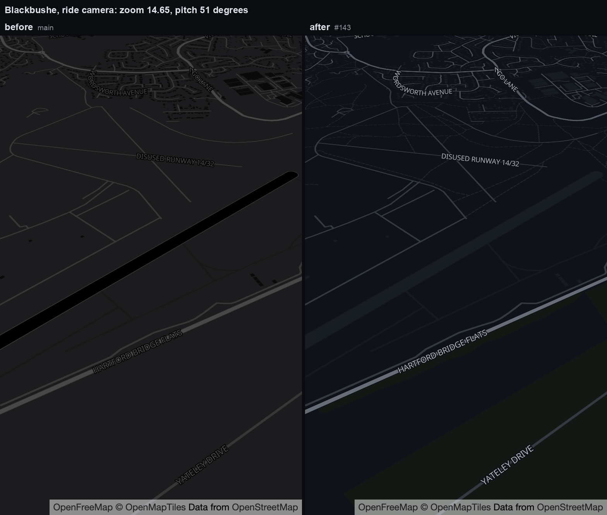

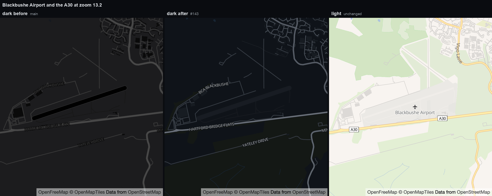

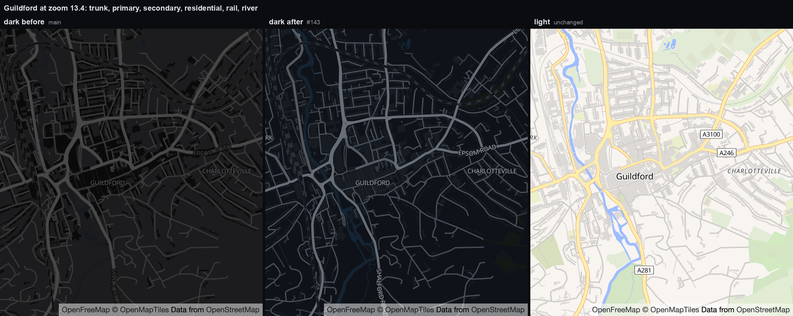

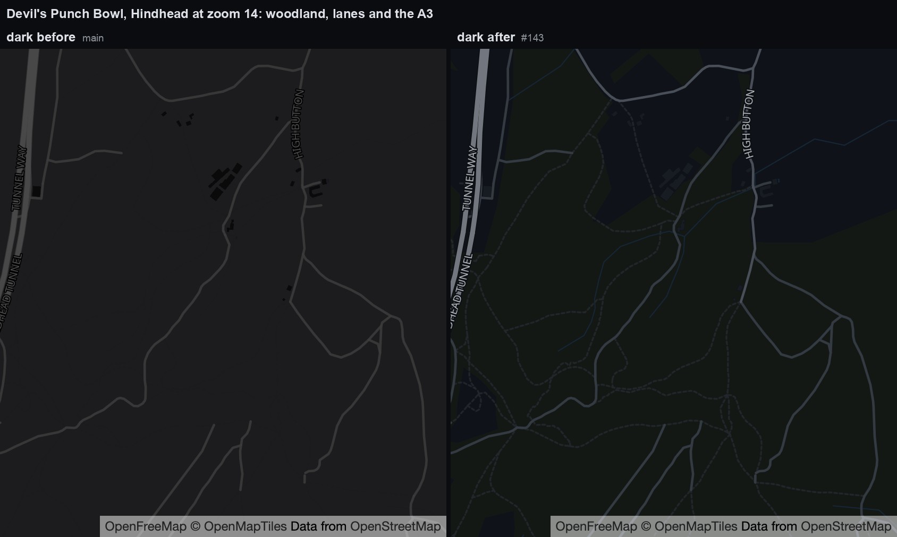

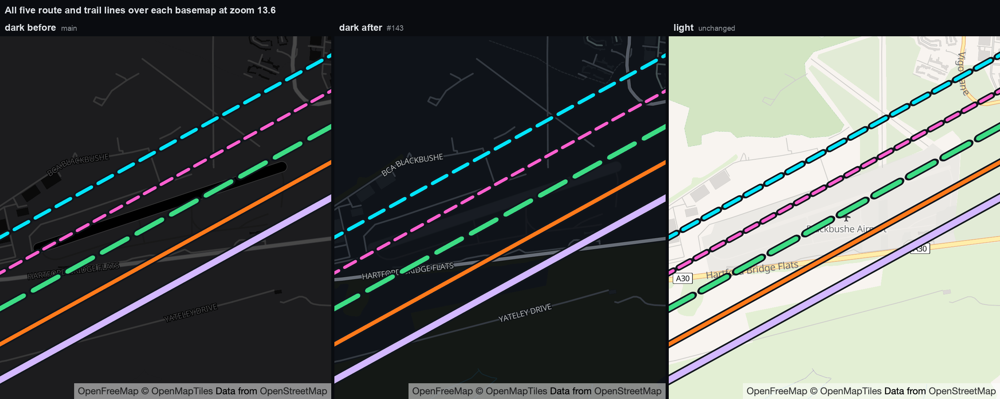

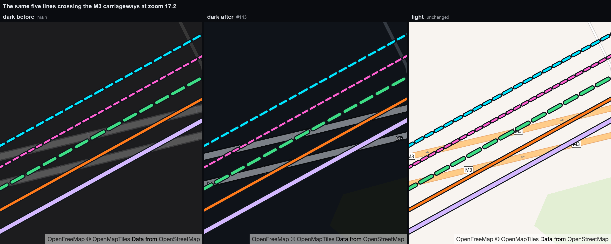

Two layers are deliberately untouched: `road_oneway` and `road_oneway_opposite`
draw a non-SDF sprite arrow, which a style cannot recolour. Everything else in the
fetched dark style — 45 of its 47 layers — is now a deliberate value.

**Not verified.** No frame here is a phone, and none is daylight. Ride-zoom
legibility on a mounted screen, and the daylight-through-a-tinted-visor photograph
that #107 still owes, cover this change too and remain outstanding.

## In-app maneuver guidance

Road routes planned through OSRM retain their maneuver steps. While the rider is
near the planned route, the map shows the next useful maneuver, remaining
distance, and road name or reference in a large banner. The banner advances only
after the rider passes the maneuver, using the same monotonic route progress as
the completed-route display. It is hidden when there is no maneuver-bearing
route or the rider is substantially off route. Imported recorded GPX tracks do
not invent directions from geometry alone. Route review reports how many turn
instructions a route carries.

### Roundabouts, direction and symbols

OSRM reports a roundabout as joining the ring and then leaving it, and the
modifier on each step describes that step alone: the entry modifier is the turn
onto the ring, which in the UK is usually a slight left whatever exit is taken.
Announcing both steps produced two "slight left" instructions for a junction
that is straight on.

Tail End Charlie therefore collapses a `roundabout`/`rotary` step and its
`exit roundabout`/`exit rotary` step into one instruction, and takes the
direction from the manoeuvre's own geometry: the `bearing_before` of joining the
ring compared with the `bearing_after` of the step that leaves it. Where the
engine emits no separate exit step, the heading before the next manoeuvre is
used if it is within 250 m. `rotary` and `roundabout turn` are presented as
roundabouts, and adjacent ring steps within 25 m are treated as one gyratory.

Mini-roundabouts need one additional path. From the reported start at BS15 1UJ
toward Chippenham, the live OSRM response puts OSM nodes 30983542 and 30983544
inside one 1,136 m `new name` step, with no manoeuvre at either node. The live
Valhalla motorcycle response likewise runs 1.219 km before its next manoeuvre.
Both node records explicitly say `highway=mini_roundabout`.

The app therefore carries a **generated layer of every `highway=mini_roundabout`
node OpenStreetMap maps** — 16,678 across Great Britain and Ireland, built by
[`tools/discovery/generate_mini_roundabouts.py`](../tools/discovery/generate_mini_roundabouts.py)
into `assets/mini_roundabouts.geojson`, ODbL with the extract date. A planned
route is enriched wherever its geometry passes within 12 m of a mapped node. The
inserted entry/exit pair is persisted with the route, so the manoeuvre list and
live guidance work after restart and offline. An engine-supplied roundabout
within 20 m always wins, preventing a future provider fix from producing a
duplicate.

This replaced a catalogue of two hand-reviewed junctions carrying hand-measured
arm bearings. A catalogue only ever covers the junctions somebody reported, its
bearings could not be checked against anything, and its tests exercised the
catalogue rather than the rule.

**The layer claims less than the catalogue did, on purpose.** Counting exits
needs the bearing of every arm, which a node alone does not carry, so no exit
number is claimed at a restored mini-roundabout: the instruction states the
direction through the junction and stops there. Saying *"mini roundabout, turn
right"* from data that supports it beats saying *"2nd exit"* from data that does
not. Rotation is stated only where the map states it — 11,482 of the nodes carry
`direction=clockwise` — and left unstated otherwise, so the renderer's own
default applies rather than the layer asserting a rotation. The `direction` tag
is also used on a handful of nodes for a compass bearing (`195`, `340`); the
generator refuses anything but `clockwise` and `anticlockwise`, because reading
one of those as a rotation would send a rider the wrong way round a junction.

An ordinary three-way intersection is still never promoted from its shape: only
a node OpenStreetMap marks as a mini-roundabout is restored. OpenStreetMap does
not mark every one, so this is coverage rather than completeness.

- The wording beside the symbol does not name the junction: the symbol is a
  drawn roundabout, and repeating the word spends a rider's glance on something
  they can already see. An exit taken third to the right reads
  *"3rd exit, right"*.
- Where nothing shows the symbol the junction is named, because otherwise
  nothing does. `ManeuverInstruction.standaloneText` is the wording used for the
  banner's accessibility label, which a rider who cannot see the symbol depends
  on, and for the CarPlay and Android Auto rows, which are plain text:
  *"Roundabout, 3rd exit, right"*. Every other manoeuvre reads the same either
  way. Wording and symbol can still never contradict each other — the agreement
  test covers both strings.
- The exit number is the engine's own `exit` count for a circular junction. It
  is dropped where two merged rings each counted their own exits, and it is
  never claimed at a mini-roundabout restored from the bundled layer, which
  carries no arm bearings to count with. With no count the instruction says
  *"Take the exit straight on"*.
- With no bearings — a route saved before they were stored — no direction is
  claimed: the instruction says *"Take the 2nd exit"* rather than repeating the
  entry modifier.
- With neither an exit count nor a direction, the wording states only what is
  known: *"Follow the route"*, and *"Roundabout ahead, follow the route"* where
  there is no symbol.
- The driving side reported by the engine only chooses clockwise or
  anticlockwise ring rendering and the handedness of a U-turn glyph. It never
  decides which way an instruction says to go.
- Roundabout symbols are drawn rather than taken from Material's
  `roundabout_left`/`roundabout_right`, which mean *which exit is taken* and
  cannot show a straight-on exit or the ring's direction of flow.
- Every instruction names a direction — left, right, straight on — or is a named
  case: U-turn, merge, fork, slip road, arrival, or an explicit
  "follow the route" where the engine gave nothing to state.

#### How the roundabout symbol is drawn

The ring is drawn as arcs with a gap where each road meets it, and the exit
leaves through its gap. A rider glances at one arrow, so the symbol carries
exactly one: the exit. There is no separate arrow for the direction of flow —
in the UK every roundabout flows clockwise, so it told a rider nothing they
needed while competing with the arrow that mattered.

- Driving side still shapes the ring: the arc from the road in round to the exit
  is the part the rider rides and is drawn heaviest, so a first exit is a short
  arc and a last exit is nearly the whole ring. Where the engine reported no
  driving side, no part of the ring is claimed as the ridden one.
- An arc shorter than three times the ring's own stroke width is not drawn, and
  the gap beside it widens to take its place. At a square left or right exit the
  arc between that exit and the road in is barely twice as long as the ring is
  thick, and drawn it read as something left in the gap the arrow leaves through
  rather than as part of the ring. The ring is then a single arc with one wide
  opening that both roads leave through, and driving side is carried by the
  wording and the arrow alone at those two angles.
- The symbol is drawn with plain strokes and fills, with no layer and no blend
  mode. Anything whose result depends on the rendering backend cannot be
  verified by the rasterised tests, which do not use the renderer on the phone.
- Where the exit turns so far back that it would be drawn along the road in, the
  road in swings to the other side of straight back, so a turn back on itself
  leaves as a V beside the road it came in on.
- Every part is placed inside the symbol's own box at every exit angle, so no
  arrowhead is lost to a clip in the banner or the all-turns list.
- `RoundaboutSymbolGeometry` works the shape out before anything is painted, so
  the ring gap and the single arrowhead are asserted rather than eyeballed.
  `test/features/map/maneuver_symbol_painter_test.dart` also rasterises every
  direction, both driving sides and the unstated case at each size the app
  draws, over both basemap panels, into `build/maneuver-symbols/`.

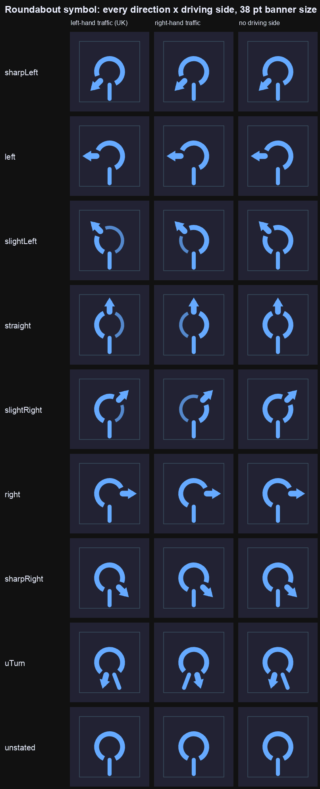

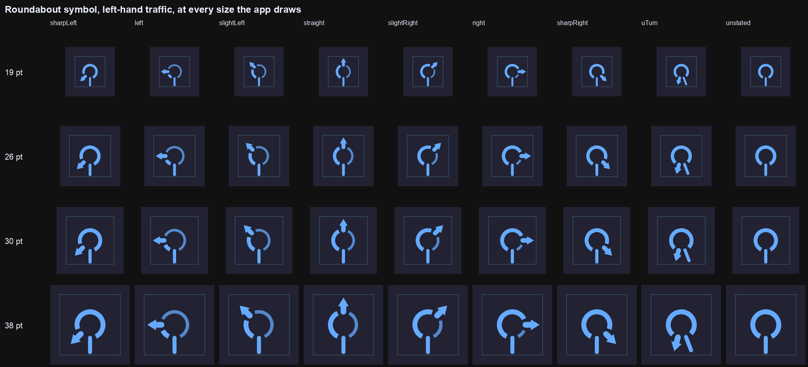

The right exit at iPhone scale, before and after the short arc beside it was
dropped:

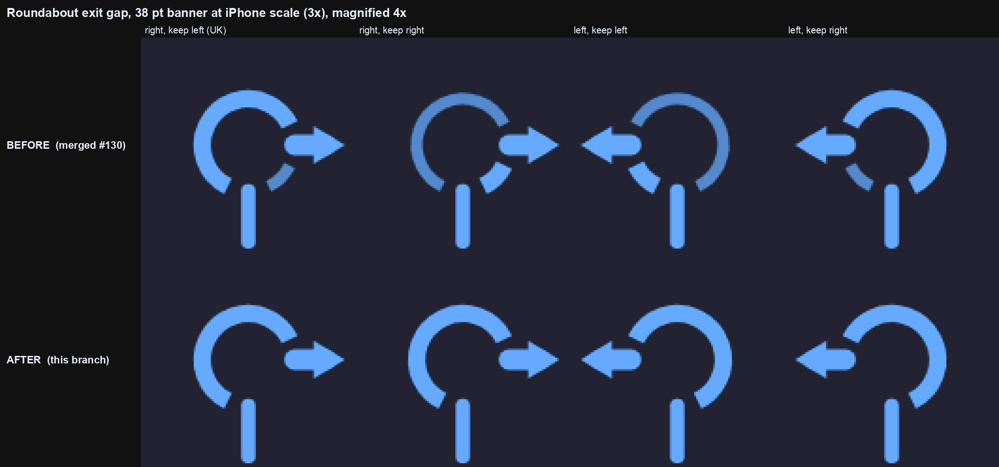

### The ride action row keeps its footprint

Each of SOS, LEAVE and REPORT reserves the space its **widest state** needs up
front, so a state change can never alter what a control occupies (#142). The
label sits in a slot sized for the longest string it can ever show and the icon
in a fixed 24 px square - an in-flight spinner is 20 px where a Material icon is
24, which used to narrow SOS before its label had even changed. There is no
`Wrap`: a `Wrap` decides its runs from its children's measured widths, which is
how "ALERT SENT" pushed REPORT onto a run of its own the moment a rider raised an
alert.

The arrangement is a function of orientation alone. Portrait stacks SOS over
LEAVE with REPORT alongside; landscape puts all three across one row, which is
what fits a 280 px rail on the narrower evaluation phone and what keeps the rail
short enough for an urgent banner to stay clear of the upper band #104 reserves
for the road ahead. Landscape buys that width from the two labels rather than
from REPORT's 62 px square, and every target stays at least 48 px in both
dimensions.

Rendered with a real font loaded, idle and after the alert is sent. Nothing moves
but the word:

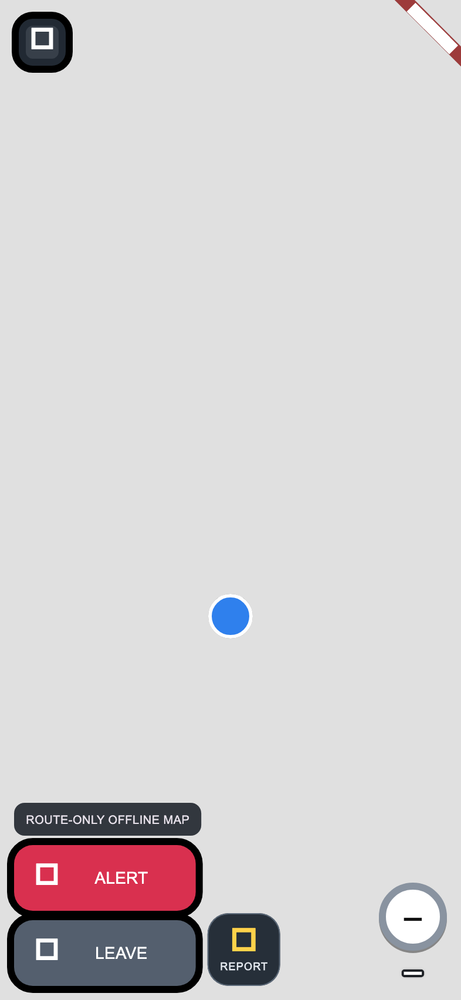

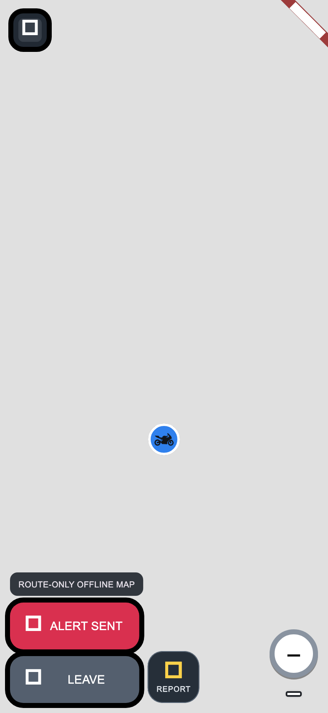

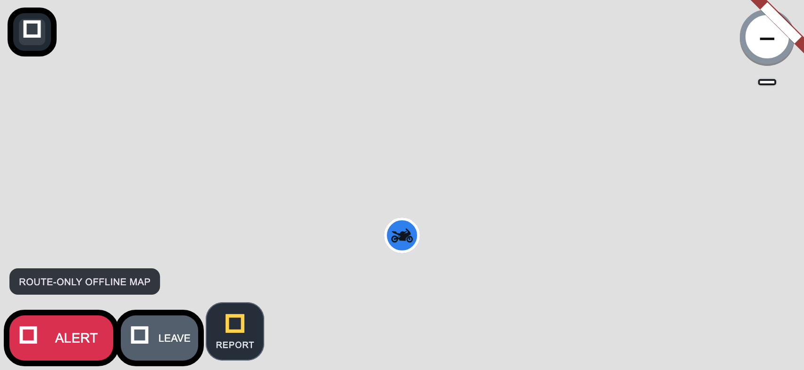


`ride_map_feature_test.dart` asserts the three rects are identical across idle,
in-flight and sent, in both orientations, that the arrangement is unchanged, and
that every target stays glove-sized.

### Lane guidance and the manoeuvre list

Lanes come from the engine's `intersections[].lanes`. Usable lanes are marked by
colour and an underline. Nothing is shown where the engine supplied no lanes, or
where there are more lanes than fit legibly, because a truncated strip would put
the usable lane on the wrong side of the road.

An **All turns** screen lists every instruction for the current route in riding
order with distance from the start, distance from the rider, direction, exit
number, road name or reference and a lane summary. It is reachable from route
review before a ride, from the map menu, and directly on the labelled Ride page
while the map is in navigation mode. It is built from the persisted route by
the same planner that drives the banner, so the two sequences match and no
routing call is made.

This guidance complements the existing Google Maps, Waze, and GPX handoffs; it
does not change or remove them. Spoken prompts are deferred until audio focus,
Bluetooth/intercom routing, interruption behaviour, and helmet intelligibility
can be tested on physical iOS and Android devices. A visual-only prompt must not
be represented as voice-guided navigation in release material.

## Destination and road routing

Every calculated route, GPX import, plan-code import, recorded route and demo
route opens a full-route review before it can replace the authoritative ride
route. The leader can inspect distance, duration when available, ordered stops
and warnings; destination routes can return to editing to replace, reorder or
delete stops and recalculate. Cancelling leaves the stored and distributed
route unchanged, while confirming produces one route update.

The map's destination action performs one user-submitted place/postcode search
and routes from the current foreground location. It does not send autocomplete
or background geocoding traffic. Latitude/longitude input bypasses geocoding.
Generated road geometry is stored as an ordinary GPX-compatible track and stays
visible offline after planning.

Development-alpha builds use the public OSRM and Nominatim endpoints. Both are
replaceable without an app update:

```text
--dart-define=RIDE_RELAY_ROUTING_URL=https://routing.example.com
--dart-define=RIDE_RELAY_GEOCODING_URL=https://geocoding.example.com
```

Destination results are cached for the app session and requests identify Ride
Relay with a valid User-Agent. The public Nominatim service forbids client-side
autocomplete and limits aggregate use; production must use an approved provider
or self-hosted proxy before scale testing. OSRM uses the driving profile, so it
produces road-following routes but does not claim Calimoto-style motorcycle or
curvy-road optimization.

## Mapped speed-limit display

The map, map menu and Settings screen carry a mapped speed-limit display for
Great Britain and the Isle of Man. **It is on by default, and an explicit
opt-out is respected.** The preference is only ever written by a rider toggling
it, so an absent key means "never chose" and takes the default while a stored
`false` stays off across an upgrade. A rider who has turned it off sees the
compact `Limits off` map control, which opens the location-data explanation
before re-enabling the layer.

**A road is resolved from the current position, not from movement.** The first
fix after the feature is enabled triggers a lookup immediately; the earlier
`waitingForMovement` entry state is retired, because withholding the readout
until the bike moved made a working feature look broken and was the reason the
field report saw `0` and `MOVE TO IDENTIFY ROAD` on a stationary phone.

The caution the delay was reaching for is now a confidence test rather than a
blanket wait:

- A **travelled** trace — two fixes at least 4 metres apart — goes to
  `trace_attributes` as two shape points. It tolerates up to 50-metre accuracy
  and a 25-to-40-metre road match, because the travel heading has to agree with
  the matched road's heading to within 50°. That is what separates the two
  carriageways of a dual carriageway, and it is the one case where movement
  genuinely helps.
- A **stationary** fix goes to `locate`, and is treated as having no heading
  *whatever course the platform reports*, for the same reason
  `NavigationHeadingSmoother` refuses a course below 1.5 m/s: a stationary GPS
  course is noise. It tolerates up to 40-metre accuracy and a **25-metre** road
  match. A phone standing still beside buildings, in a car park or in a lay-by is
  routinely displaced 10–25 metres by multipath and the rider is plainly on the
  road they are parked beside, so a tighter bound reports nothing in the one place
  riders look first. It is not widened past 25 metres because UK roads carrying
  different limits are rarely that close together. A road the rider is probably
  not on is reported as unmatched rather than guessed at: a wrong limit is worse
  than an absent one.

`trace_attributes` needs at least two shape points — a one-point shape is
rejected with `error_code` 123, `Insufficient shape provided` — and it reports
only the single edge it matched. Both facts matter at a ride start. The first is
why a stationary lookup used to resolve to nothing at all; every trace the app
sends now carries two points, and for a confirmation that means the same point
twice. The second is why the stationary path leads with `locate`, which takes one
point and lists every nearby road with its own distance, road class and posted
limit.

Where several roads are within tolerance, a **carriageway is preferred over a
service way** — a car park aisle, driveway, alley or footpath — even when the
service way is the nearer of the two, and among carriageways the higher road
class is preferred. That is a judgement, not a fact: a rider setting off is on the
road, not the alley beside it. It is bounded by agreement. If the preferred
candidates still post different limits, as they do standing where a 30 becomes a
50, the reading stays unconfirmed and resolves on the next fix or on movement
using heading, rather than one of the two being chosen.

`locate` reports no country of its own, so the GB/Isle of Man requirement is met
by a `trace_attributes` confirmation sent at the chosen road's own snapped
position — and only when a mapped value is actually about to be displayed. A
position with nothing to show costs one request, not two, and the country that
comes back belongs to the road on the sign rather than to whichever edge a map
match happened to prefer.

Ambiguity is stated, not hidden. Poor accuracy or an uncertain match resolves to
`unconfirmedRoad` — named for the condition, not for a wait — which shows `GPS
accuracy too low` or `Road not confirmed` and is retried where the rider stands
every 5 seconds, or immediately once the bike moves. A settled negative (no
mapped limit on this road, outside the UK) waits for the bike to move rather than
re-asking about a spot that cannot change; an unreachable service is retried on
the ordinary 15-second interval. Once a limit is known, rechecking still needs
both 25 metres of travel and 15 seconds.

Lookups are fed from the navigation fix rather than a bare position, because the
confidence test is built on reported accuracy and heading and a position
carrying neither cannot be tested at all.

The steady-state display is prefetched rather than allowed to wait at every road
change. At most every 30 seconds or 150 metres, one `trace_attributes` request
samples the next kilometre of the remaining route at 25-metre intervals. With no
route, the same samples are projected along the current heading. Results are
cached in memory by OSM way plus direction and applied only within 45 metres of
the map-matched sample with a compatible heading. Conflicting nearby roads are
not guessed: the cache yields to a current-road lookup and the sign shows the
honest dash if that lookup cannot disambiguate them. Because the cache is local,
already-prefetched numbers, unknown-road dashes and unrestricted-road readings
survive a signal drop during the ride.

Only an OpenStreetMap `maxspeed` value is displayed, and it is read from
Valhalla's `speed_limit` attribute, documented as "the posted speed limit, if
available" and as the attribute a navigation application should display. Valhalla
sets it only from a `maxspeed` tag, so an untagged road omits it and stays
unknown. It is **not** gated on `speed_type`, which describes something else: how
the edge's *base routing speed* was assigned. The live FOSSGIS instance reports
`speed_type: classified` on roads that carry a perfectly good explicit
`maxspeed` — verified on the A4174 at 50 mph, the M4 at 70 mph and a residential
20 mph street — so requiring `tagged` withheld every genuine posted limit and was
the second half of the ride-start failure.

Valhalla serialises an explicit OpenStreetMap `maxspeed=none` as
`"speed_limit": "unlimited"`; an untagged road omits `speed_limit`. Those live
responses were captured separately from Isle of Man OSM way 25985919 (Ballanard
Road/A22) and the untagged bundled-demo-start way 844320294. Valhalla reports the
former with country code `IM`, so that mph jurisdiction is accepted alongside
`GB`. The app renders the first as `∞` and the second as `–` without inventing an
unrestricted road from missing data.

The value must also convert to one of the six limits a UK sign carries (20, 30,
40, 50, 60, 70 mph) or it is treated as unknown. That keeps an inferred or foreign
value off the sign and fails safe on units: every UK limit read in the wrong unit
falls outside the set rather than producing a plausible wrong number.

After the first lookup completes the sign has exactly three visual states:
number, dash or infinity. A loading indicator is allowed only for that first
resolution; a later refresh keeps the last completed state visible until the
next answer arrives. The UI uses mph and familiar UK sign styling, labels the
reading `MAPPED`, and always warns that it is not live: temporary and variable
limits may differ and roadside signs apply.

OpenStreetMap `maxspeed` coverage in Great Britain and the Isle of Man is real
but patchy, and that sets a floor on what the feature can show. The bundled demo
route's own start point is a worked example: the King's Oak Academy car park
access road is untagged, and the nearest road, Brook Road 43 metres away, is
untagged too, so no tolerance can honestly produce a number there. The A4174
ring road a few streets away is tagged throughout. Absent readings on minor
urban roads are a data limitation, not a bug.

The sign is drawn straight onto the map with no surrounding panel. The rider's
own GPS speed appears directly beneath it at the sign's own font size, so the
two numbers can be compared at a glance. That readout stays in mph regardless
of the rider's distance-unit preference, because two different units under one
mph sign would invite a dangerous misread. It is the smoothed foreground GPS
speed already used for the navigation camera, it is never sent anywhere, and it
shows `–` when the platform reports no usable speed. Labels outside the white
sign face are stroked as well as shadowed so they stay legible over both the
day and night basemaps.

There is **no caption under the readout**. A red-ringed UK sign above a plain
number is already unambiguous, and the nine-point
`MPH · MAPPED LIMIT · GPS SPEED` line cost glance time on a moving bike without
adding meaning. Its wording was not lost: the badge's accessibility label and
tooltip still say which number is the sign and which is the rider, that the
limit is mapped rather than live, how stale it is, and — when there is no
reading — which condition is holding it up.

`PostedSpeedLimit.checkedAt` is the lookup time, not the age of the underlying
OpenStreetMap tag. The provider does not expose a reliable source-update time,
so data freshness is explicitly unknown. Current and prefetched readings are
kept only in memory and cleared when the user turns the feature off; the cache
is not persisted across app launches.

Alpha builds default to FOSSGIS/OpenStreetMap.de's public Valhalla instance.
The endpoint is replaceable without an app update:

```text
--dart-define=RIDE_RELAY_SPEED_LIMIT_URL=https://routing.example.com/trace_attributes
```

The `locate` endpoint is derived from that URL by replacing its final path
segment, so a self-hosted deployment cannot end up with the two halves of the
lookup on different hosts. It is deliberately not separately configurable.

Valhalla is MIT-licensed and its OpenStreetMap-derived road data is ODbL with
attribution required. The app credits `© OpenStreetMap contributors` in the
setting and reading detail. The FOSSGIS endpoint is a free public demo subject
to fair use and rate limits, not a contracted or production service; requests
include the requested `X-Client-Id: tailendcharlie.app`. Before any public
tester rollout that enables this endpoint, the project must notify its
operators as requested in the Valhalla repository.

A production release needs an operated Valhalla service or licensed provider,
capacity monitoring, and Great Britain/Isle of Man road tests covering
direction, parallel roads, junctions, national or unrestricted roads, temporary
limits, and variable limits. The current alpha integration has no per-request
provider fee, but operating a production instance or selecting a commercial
source has an unresolved cost.

Provider references:

- [Valhalla trace attributes and country/speed metadata](https://valhalla.github.io/valhalla/api/map-matching/api-reference/)
- [Valhalla locate service, single-point candidates and `radius`](https://valhalla.github.io/valhalla/api/locate/api-reference/)
- [Valhalla road classes, highest to lowest](https://valhalla.github.io/valhalla/api/turn-by-turn/api-reference/)
- [Valhalla speed source semantics](https://valhalla.github.io/valhalla/concepts/speeds/)
- [Valhalla data licences](https://valhalla.github.io/valhalla/contributing/data/data-sources/)
- [Valhalla attribution requirements](https://valhalla.github.io/valhalla/mjolnir/attribution/)
- [Public demo fair-use and client identification](https://github.com/valhalla/valhalla#demo-server)

## CarPlay draws with MapLibre, and shares the phone's tiles

The head unit renders with `MLNMapView`
(`CarPlayNavigationViewController` in
`apps/mobile/ios/Runner/CarPlaySceneDelegate.swift`), the same renderer and the
same style documents as the phone.

It began on MapKit, which was easier to stand up on a projected `CPWindow` and
cost two things that turned out to matter more on a car screen than on a phone:

- **The basemap needed a connection.** MapKit has no access to the ambient tile
  cache the phone fills, so the surface a rider actually looks at while moving
  was the first one to go grey in a signal gap — the opposite of the
  offline-first behaviour the rest of the app is built for, and the same shape
  of fault as #274/#281.
- **None of the measured styling reached it.** The dark basemap and route
  palette in [Riding display](#riding-display) were chosen against #107 and
  #143 for a rider reading through a tinted visor in daylight. CarPlay got
  Apple's defaults instead.

Both styles travel in the projected snapshot (`basemap.styleUrl` and
`basemap.darkStyleUrl`) rather than being read from the environment natively,
because the car has its own day/night state and picks between them from its own
trait collection — the head unit can be in night mode while the phone is not.

Two things about the MapLibre lifecycle here are not obvious and are the reason
this is written down:

- **A style load clears every annotation with it.** The last snapshot is
  retained and replayed from `mapView(_:didFinishLoading:)`, or the route and
  riders vanish the moment the car switches to night mode.
- **The map view is built when the first style arrives, not in `loadView()`.**
  An `MLNMapView` with no style URL renders nothing useful and does not restyle
  cleanly afterwards, so the canvas starts as a plain black view and installs
  the map once Dart has named a style.

CarPlay's own map buttons own the bottom-trailing corner, so MapLibre's logo and
attribution are moved to the bottom-leading one. Attribution stays visible: it
is a licence condition, not decoration.

## MapLibre provider configuration

Development-alpha builds default to OpenFreeMap's public Liberty style for an
online, no-key basemap. Its public service has no availability guarantee, so it
is an alpha convenience rather than the production dependency. The project owner
approved persistent caching for the default provider, so it is enabled unless a
build deliberately switches it off. Override the provider for production or a
self-hosted deployment with the settings below.

Supply an HTTPS MapLibre style whose tile, sprite, and glyph licences permit
mobile display and, if enabled, offline downloads:

```text
--dart-define=RIDE_RELAY_MAP_STYLE_URL=https://relay.example.com/maps/styles/ride-relay.json
--dart-define=RIDE_RELAY_TILE_ATTRIBUTION=© OpenStreetMap contributors
--dart-define=RIDE_RELAY_TILE_MAX_ZOOM=18
```

Offline download additionally requires explicit approval and a versioned cache
namespace:

```text
--dart-define=RIDE_RELAY_TILE_CACHE_ALLOWED=true
--dart-define=RIDE_RELAY_TILE_CACHE_NAMESPACE=open-map-style-v1
```

The app uses MapLibre's native offline-region database. It calculates a padded
route bounding box, downloads zoom levels 10–15, caps a request at 2,500 tiles,
shows progress, supports cancellation, and deletes only regions belonging to
the configured namespace. Long or antimeridian-crossing routes must be split.
The HTTPS style is validated, its relative resources are normalized, and an
approved copy is cached for 24 hours. If no valid style is reachable or cached,
the app falls back to a bundled blank style so the local route and overlays
remain visible instead of failing the whole map.

The older HTTPS raster XYZ configuration remains as a development fallback:

```text
--dart-define=RIDE_RELAY_TILE_URL=https://licensed.example/{z}/{x}/{y}.png
```

It is not the recommended production path.

## Self-hosted maps

The optional `maps` deployment profile runs the official MapLibre Martin tile
server and accepts operator-supplied MBTiles or PMTiles archives. Large datasets
and provider styles are deliberately excluded from Git. Put a schema-matched
archive in `deploy/maps/data`, its style/sprites/glyphs in
`deploy/maps/styles`, and start:

```bash
docker compose --env-file deploy/.env -f deploy/compose.yaml \
  --profile maps up -d --build
```

OS Open Zoomstack is a viable free Great Britain dataset if its supplied style
and attribution are adapted together. OpenStreetMap-derived OpenMapTiles or
Protomaps data are other open choices, but their attribution and data/style
licences still apply. The public `tile.openstreetmap.org` service forbids bulk
offline downloading and is never a default.

## Offline states

| State | Route | Basemap |
|---|---|---|
| No provider | Fully local | Explicit route-only canvas |
| Style, offline not approved | Fully local | Online only |
| Style, offline approved and downloaded | Fully local | Native offline region |

Riders should open the prepared route in flight mode before departure. A
successful download is not a safety guarantee; real-device storage, provider,
and coverage edges remain part of the field-test matrix.

## Primary references

- [OpenFreeMap quick start](https://openfreemap.org/quick_start/)
- [OpenFreeMap terms of service](https://openfreemap.org/tos/)
- [MapLibre Flutter SDK](https://github.com/maplibre/flutter-maplibre-gl)
- [MapLibre Martin tile server](https://maplibre.org/martin/)
- [OpenStreetMap tile usage policy](https://operations.osmfoundation.org/policies/tiles/)
- [OS Open Zoomstack](https://www.ordnancesurvey.co.uk/products/os-open-zoomstack)
- [GPX 1.1 schema](https://www.topografix.com/GPX/1/1/)
- [OSRM route service](https://project-osrm.org/docs/)
- [Nominatim usage policy](https://operations.osmfoundation.org/policies/nominatim/)
